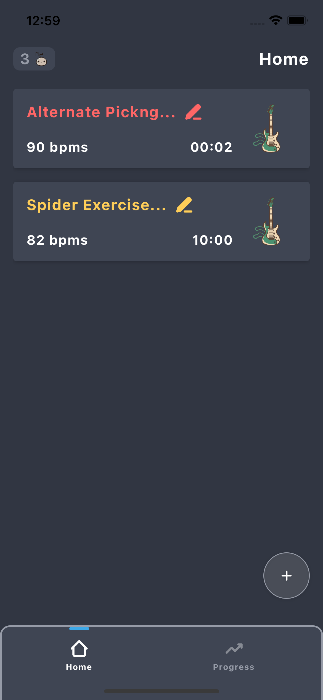
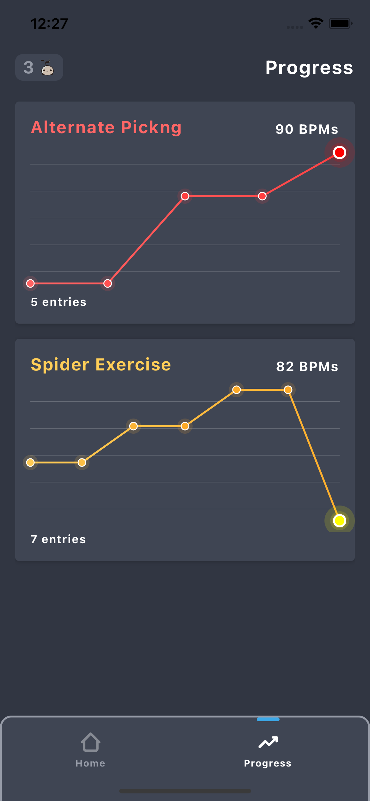

# ShredMaster

An exercise tracker for your musical practice sessions.
---

  
  
  

  ---
<h3>Technologies used:</h3>
<ul>
  <li>Expo!</li>
  <li>TypeScript!</li>
  <li>React Native Reanimated!</li>
  <li>React Native Skia! 🖍️</li>
  <li>React Native Gesture Handler! 🤏</li>
  <li>Amazing original components! 😜</li>
  <li>Original Charts drawn from scratch! 📈</li>
  <li>Cool original characters drawn on Midjourney and converted to svg! 😎</li>
</ul>

<h3>How to run</h3>

  Install the dependencies and run 'npx expo start'. Have fun 🤘
  (Not too much fun, practice hard!)

